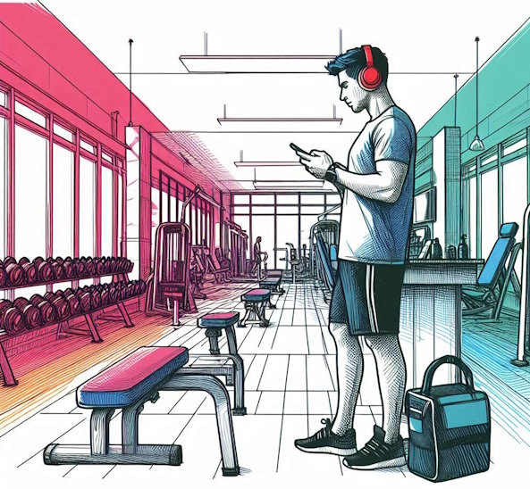

In my post [The Economics of “Messy” Gyms](/2024/08/the-economics-of-messy-gyms/), I discussed how proper gym etiquette seems to have disappeared over time. Now, with fewer young staff members working at gyms, we're seeing the consequences: facilities are becoming increasingly disorganized, and members are showing less consideration for others.

> A generation of lifters never had the experience of a big guy getting in their face for not putting the dumbbells back in the correct spot. Now their gym is a mess and the “now hiring” sign has been up for months with a growing list of open positions.

My [Tales from the Glitter Gym](https://criticalmas.org/best-of/tales-from-the-glitter-gym/) series is based mostly on my mocking people for inconsiderate behavior at the gym. As I've gotten older, I've become more accepting of the situation, because, in their defense, they never had my role models.

In this post, I will outline my code of conduct. These are the rules that I follow when I go to the gym. By today's standards, they would be considered "above and beyond" what is expected today.

### #1 No headphones

I don't care how bad the music is, I don't wear headphones in the gym ever. I want to be alert to my surroundings for my safety and the safety of others. People are walking around with plates, dumbbells, and kettlebells. I want to hear them if they are approaching me from behind.

I don't need music to get pumped up.

### #2 Never look at my phone

I have a policy to never look at my phone at the gym. I see too many people camped out on equipment staring at their devices. They could complete their workouts quicker and reduce the wait time for others if they had my policy.

The only exception I have is if I need to review a video for exercise form. If I need to do that, I leave the weight room and go to the front desk. Stand out of the way, review the video, and then put my phone away before returning.

I don't have an issue with others using their phone on cardio equipment.

_Headphones, phone, and carrying a bag into the free weight room._

### #3 Never carry gear around

There are always a few people who carry bags or backpacks with them at the gym because they don't want to use the lockers. Sometimes they'll use their gear as a way to mark their territory while they are elsewhere in the gym. So rude. Don't do this. Gyms have a limited shared space for members, not your crap.

Some psycho in my gym holds his favorite piece of cardio equipment with his motorcycle helmet while he lifts.

### #4 Rack Weights

Most people know what it means to rack their weights - except those animals that lift weights after 10 pm. Rack your weights. This means not only putting the weights back but putting them back in the correct spot. Don't place a 25# plate over a 45# plate.

### #5 Tiny towel

In the weight room, there are three schools of thought on wiping down equipment. At one end, you have the animals that leave piles of sweat on the equipment. At the other end, you have those who wipe everything down with antibacterial wipes as if they had committed a crime and need to remove DNA evidence.

I take a middle approach. I carry a tiny towel that I place on the equipment, even though I never break a sweat in the gym. I'm demonstrating respect without looking like a neurotic germaphobe.

Cardio equipment does need to be wiped down.

### #6 Time to Lean, Time to Clean

Because I'm not staring at a phone between sets, I will look around for little things in disarray and fix them. I'm not picking up water bottles, but if I see a plate on the floor or in the wrong spot, I'll move it into its proper place.

Backpackers like to leave the trail better than they found it. Same principle. I'm setting an example for anyone paying attention.

### Last Words

Imagine how much better gyms would be if others followed the points listed above. Maybe I am just an [old guy](/2024/03/tales-from-the-glitter-gym-the-old-guy/) rambling? Is there anything you would add to the list?

---

## Comments

### Geoff
*November 9 at 2024 at 7:23 PM*

What a wonderful world it would be if everyone followed these guidelines. You can still find gyms where this (and more) is expected, but you have to make a point of looking for it.

My only addition is this: Don’t hop on a bench or piece of equipment just because the last person walked away for a second. Ask if they’re finished and, if not, whether they mind you “working in”. Same principle applies for dumbbells and kettlebells- don’t just grab them because the last person walks away for a few seconds.

---

### MAS
*November 11 at 2024 at 3:20 PM*

@Geoff - True. However, since everyone today has headphones on, getting someone to hear you might be a challenge.

---

### Julia
*November 16 at 2024 at 8:24 PM*

Wow. Well, I break a lot of these. TBH, I'm so torn between "wiping down with an antibacterial wipe" and just doing nothing and leaving my sweat there. 

As a woman, I always wear headphones so I don't get hit on by random men. #gymhack Not that I'm Helen of Troy! 

I like the "leave places better than you find them" approach outlined by avid hikers. 

TBH, I'm trying to leave places better than I find them in other aspects of life (LOL), not just hiking! now you have me thinking &amp; I'll probably write a post about this on one of my blogs. Thanks for the inspo! 

Since I'm soooo into diet &amp; nutrition in the last 7 (or so) months, I have been checking to see if you have a new post. I guess this post was about a week ago now, I just saw it today. 

I have lost 31 pounds in 7 months doing low carb (even though you don't like that weight-loss strategy cleary!) And I actually did three different programs. Autumn Elle Nutrition (Autumn Bates on Youtube) first; I lost 20-21 pounds April to Sept doing AEN. 

Then for 11 days in Sept I did NSNS ("No Sugar, No Grains" which is Vinnie Tortorich's program) but then I had signed up for a class "Keto Made Simple" with Adapt Your Life Academy. That's how I lost the last 10-11 pounds. I'm still doing Keto Made Simple now. 

I'm thrilled at my weight-loss success. I NEVER would've thought I could lose this much weight. I tried so many things. FWIW, cutting out the carbs &amp; the sugar = the only strategy that works for me.

---

### MAS
*November 16 at 2024 at 9:11 PM*

@Julia - Good point about the female prospective. That reminded me of this 2-part post I did back in 2008 that you might enjoy.

https://criticalmas.org/2008/07/tales-from-the-glitter-gym-the-pick-up/

---

