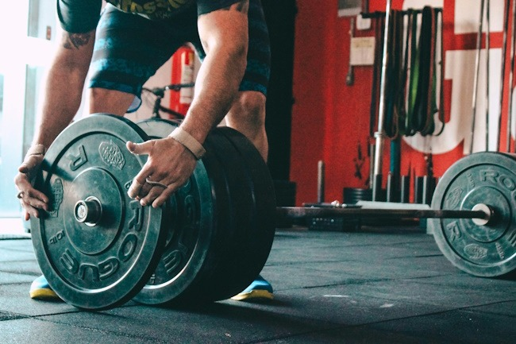

There are numerous posts on this website where I talk about how much I love high-intensity training. In 2011, I posted [High Intensity Training - My 6 Month Update](/2011/05/high-intensity-training-my-6-month-update/), which was a good overview of HIT.

As much as I love safe exercises and using slower tempos to increase intensity, there are some aspects of HIT that I reject or dislike.

### Too Efficient

I like going to the gym. I'm currently going to the gym three times a week. Each visit is about 20-30 minutes of exercise. When I was doing HIT by the book, I would do a single 10 minute workout every 5 or 7 days.

For people that don't like to go to the gym or have a busy life, I can totally see the efficiency of HIT to be a selling point. Initially, this efficiency was a novelty to me, and I embraced it fully.

However, I have plenty of time. I work from home and have most of my groceries delivered. I can go weeks without leaving my zip code. Back in my San Diego days, I spent 90 minutes a day commuting. I spent my weekends shopping and running errands. Had I known about HIT back then, it would have been a tremendous benefit.

I know I am not alone here. Those of us that understand how powerful HIT can be are also those of us that prioritize exercise. When we aren't at the gym, you can often find us reading articles or watching videos about exercise. We came to HIT to save us from the bro-lifts that led to too many injuries, not to keep us out of the gym.

### Recovery

I wrote this paragraph [about HIT in 2011](/2011/06/training-to-failure-or-training-to-quit-part-2/).

> The High-Intensity Training crowd is clear about taking the muscles to total failure and then allowing time to recover as the optimal method for building muscle. I’ve read the science and experienced it first hand. It works. However, if I had to perform at a high level on a daily basis, I wouldn’t be doing this method of training. When I return from the gym, I’m toast. The next day, I move in slow motion. By day three, I’m still below baseline performance. This is perfectly fine for me, as I push pixels. I would not want to train like this if I were a lifeguard.

Maybe it is because I am now 13 years older or maybe it is because the work I am doing today is more mentally taxing than what I was doing in 2011, but I am no longer fine with being wiped out for days following a train-to-failure workout.

I lift in the morning at 5 AM on weekdays. My gym does not open until 8 AM on the weekends. Way too late for me, so I can't schedule in a failure workout on Saturday. If I destroy myself on a weekday, I won't perform well at my job, so I don't. In 2011, this wasn't a concern, now it is.

### Core Failure

I could be wrong on this point and you can correct me in the comments if I am, but I think HIT falls short when it comes to building a strong core. Using machines is great for placing the large muscles under load safely, but I never felt my core engage like it did with free weights. With free weights, a lot of the core work actually comes from loading and unloading the weights. Moving a pin on a machine requires no engagement by the abs.

Body By Science has a few pages on the Abdominal Machine, but it is not part of the Big-Five workout. It is optional. At least, [Hillfit](/2024/04/the-return-of-hillfit/) has a plank.

A common theme that I've read across all forms of lifting literature is to focus on the big lifts and the abs will get strong, but you are free to add in additional ab work if you want. So HIT is not unique to this critique, but I think having weaker abs will catch up to you faster with free weights than machines.

For my fellow HIT fans, if you were to give HIT a letter grade for core strength, what would it be?

_Loading and unloading plates will engage the abs. Photo by [Victor Freitas](https://unsplash.com/@victorfreitas?utm_content=creditCopyText&utm_medium=referral&utm_source=unsplash)._ 

### The Message

I was fortunate to stumble on the ideas of HIT at a time when they were more accessible to fitness enthusiasts. Several of the sites or resources that I used to learn HIT are gone now or have decided to direct their message to other HIT trainers.

Every so often I'll see some HIT video or article. Most are too long and boring. Meanwhile, the production quality for the bro-lift videos keeps improving.

I wrote this comment on a 2018 post.

> My disappointment with the HIT community is they only seem to be talking to the exercise nerds that are willing to sit down and read 5,000-word articles on the most minute points.

### Last Words

I still use the core HIT principles of safer exercise selection and slower movements. I rarely go to failure. I'm now prioritizing core strength and I'm doing it outside the gym (mostly YouTube videos).

---

## Comments

### exfatloss
*November 28 at 2024 at 11:02 PM*

Variable resistance HIT with bands (e.g. x3) does engage the core, right? So it's more the machine aspect maybe. I do agree that a strong core is great. Ties the whole thing together, if you will.

---

### MAS
*November 28 at 2024 at 11:31 PM*

@exfatloss - Yes, bands would engage the core. 

Yet, I don't see bands recommended for HIT training. Probably because HIT exercises tend to be low skill that one can safely take to negative failure, which is why machines are mostly recommended.

---

### Dan
*December 1 at 2024 at 4:31 PM*

My thoughts on HIT is that as a stand alone workout it's very good and time efficient.  However, if you play sport or your job requires you to perform at some physical level, then going to that level of failure it's going to impact your job or sport.   I bought into HIT for a few years, the evidence based part of my thought process liked it.  However,  it is not how I train now, a more movement based approach, and I move better and haven't declined in strength.  Certainly your core misses out on machine work.   The strongest people I've ever encounter in judo were always people who did some sort of manual work and not the those who had great gym numbers.

---

### exfatloss
*December 1 at 2024 at 4:41 PM*

@Dan

I think this is because for pure strength, you need to maximize both muscle growth and nervous system adaptation. In many cases, especially where power to weight is a concern (like pull-ups or climbing), more muscle can actually be a detriment.

When I did CrossFit, a popular contest was who could do the most pull-ups. By far the winner every single time was a middle aged, skinny plumber. He wasn't particularly strong in deadlifts or squats, but his forearms were just out of this world, and he was light. He could pretty much do 2x as many pull-ups as the next guy. I believe this is called "old man strength" haha.

HIT doesn't seem to consider the "nervous system" or "technique" or "technical" strength aspect at all, they just want to maintain/build muscle mass with the least effort possible.

I do think this is somewhat reductionist; surely a part of aging well is actually knowing how to grip &amp; lift things, not just having literal lean mass sitting on your body.

---

### Al
*December 1 at 2024 at 11:43 PM*

I think you hit the nail on the head in your Last Words -

"I still use the core HIT principles"

The key word is "principles". It is easy to get locked into some dogmatic ideas in HIT just like anything else. 

[Not to mention,  I've run into a few HIT gurus (online) that are just (IMO) a tad weird. There are a few that I don't think I would enjoy having a beer with. I'll just leave it at that.}

That said, I've picked up some great ideas from those guys. The search for the ever more minimalistic routine is not best for everyone. I'm retired, have the time for training and enjoy it. So I do something every day, even if it just a short mobility routine. Every 2 or 3 days I hit the gym for the meat of the strength stuff. That is where the machines are! But...like you, I'm done in 30-40 minutes doing full body workouts, and tacking on some intense flexibility work. I like to do that at the gym, because I stretch better after a workout, and like to use apparatus to make the stretching better, just like the machines are "better" for *my* lifting. Most every HITTER tells you STRETCHING IS POINTLESS!! Maybe for them, but I enjoy it, like the results so I do it regardless of its "pointlessness"

As for abs, I believe Dr Ben Bocchiccio  advises just a few crunches with good form at then end of a HIT session that is all machines. The abs generally are not prone to hypertrophy. I include them in my short mobility work on days away from the gym just to check the box.

For me the core principles are slowish movements, good turnarounds, and intensity. Sometimes I go to near death failure, but mostly I get near it, then add on some myoreps or isometric holds.  So the actual hard lifting is 20-30 minutes 2-3 week.

All good!

---

### AL
*December 1 at 2024 at 11:57 PM*

@exfatloss - One of the HIT principles I do take to heart is that simple hard safe strength training is, on it's own,  by definition,  functional, and we want less technical things involved, not more. Not trying to build balance or stability, or skill based lifting.

If you want skill in a thing (chins, frisbee, OLY lifting) get that skill through that thing, not your strength training. To me, that is incredibly freeing and efficient.

YMMV.

---

### MAS
*December 2 at 2024 at 3:19 PM*

@Al - I used to the word core instead of abs to lump together not just the abs, but the lower back, the obliques, the glutes, groin, etc. Crunches might be fine for ab hypertrophy, but I don't think that is sufficient. 

Core issues can lead to posture issues can lead to knee issues, etc. 

I don't feel HIT has helped me in the core. Hillfit has a plank - which helps - but even that isn't enough. I don't know the answer but it is a focus of mine now that my hernia operation is a year old.

---

### Dom
*December 22 at 2024 at 3:41 PM*

MAS,

There's an almost guaranteed cure for core weakness that is also time efficient, doesn't leave you wiped out, and delivers great results in a reasonably short time: 

Paused front squats, done PTTP-style. 
With the caveat that one focuses more on perfect form first and less on numbers, maybe even start with DB goblet squats.

Yes, it's a bro-lift. 
But you know it will work.

---

### MAS
*December 22 at 2024 at 4:22 PM*

@Dom - Interesting. I do goblet squats 1-2x a week, but I've never tried the pause variation. I will try it out. Thanks for the tip.

---

### Skyler
*December 30 at 2024 at 6:51 PM*

Using one version of HIT to incorrectly tar and feather a whole suite of protocols is…strange. 

Greg had lower back and other trunk machines, and he trained people multiple days a week when appropriate. Doug recently posted a routine where he trained his back including direct neck and lumbar work.Others have used this at the highest levels of athletics, where gross strength deficits would be exposed as increased injury rates.

Choose exercises for your lumbar, obliques, and rectus if you want to train your trunk completely, due to need or desire.

---

### Chris
*March 6 at 2025 at 11:09 AM*

interesting discussion and good to see Skyler's name there.

With respect to bands the two issues that are frequently highlighted as concerns are (1) safety - bands have a habit/risk of snapping and injuring the user.  I've had a few that have perished or where a nick on the band becomes a tear that cases a failure of the equipment (2) the resistance curve - the resistance get higher the further the band is stretched, however the strength curve of most movements would need the resistance to be higher in the middle of the movement and less at the start and finish. (but that is a whole different topic)

The key thing for me is the principles - something simple, safe and accessible.  HIT on bodyweight can get you there.   Recently most of my training has been using isometrics based on Ken Hutchins timed static contractions.   Definitely simple, safe and accessible.

---

### exfatloss
*March 6 at 2025 at 5:01 PM*

@Chris

I did the x3 band system for a year, and I disagree on the resistance curve. This gets brought up frequently as a critique of bands, but I think it's just largely not true. For almost all exercises, the resistance curve of bands is preferable to any other I've seen (e.g. free weights).

The only x3 exercise where the resistance curve should be higher in the middle and then decrease again is the bent row.

How do you train deadlift/squat type movements with bodyweight? I'd agree that you can easily traing the upper body with bodyweight exercises, but I've never found a deadlift or squat replacement.

---

### MAS
*March 7 at 2025 at 4:19 PM*

@exfatloss - Did you stop using x3, if so why?

Chris wrote a book on a bodyweight HIT program called Hillfit, which you can download from GitHub. Details here:

https://criticalmas.org/2024/04/the-return-of-hillfit/

---

### exfatloss
*March 7 at 2025 at 4:32 PM*

@MAS

Yea I stopped after almost exactly a year. Nothing was wrong, I just became disinterested in exercise. Curiously, it happened during one of my 5 day fasts late last year. During the fast, my exercise performance went way down. After I finished the fast it came back, but I just couldn't motivate myself or something.

I'll check out that book, thanks! I assume it involves hill sprints? Haha.

---

