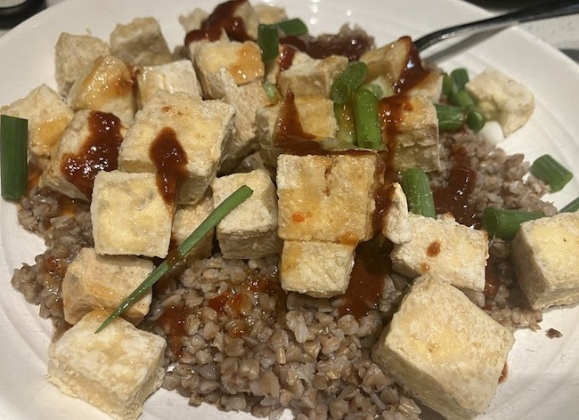

For the first time in my life, I tracked all the food I ate for a full month. I did not weigh the food. I started January at the weight of 183 and ended at 183, which is a BMI of 23.2 (Normal). I used the Day One app, which is supposed to be for journaling, to jot down whatever foods I consumed. Then I exported the entries to a JSON file and asked ChatGPT to summarize the data. I consumed no soft drinks, juice, or alcohol. This was a one month only experiment. A time capsule. Maybe I'll do a new one periodically, as I have a long history of changing my diet.

### **Common Foods and Patterns:**

-   **Frequent Foods:**
    -   **Chia seeds:** Consumed almost daily.
    -   **Fat-Free Greek yogurt with hemp seeds, blueberries, flaxseed:** A regular combination.
    -   **Apples:** Appeared frequently, often as a snack.
    -   **Kimchi:** Often paired with sprouts or other vegetables.
    -   **Cooled potatoes:** Eaten both plain and with proteins like herring or tempeh.
    -   **Tempeh tacos:** Recurring with variations like Korean-style with onions and cabbage.
    -   **Chickpea soup:** Included spinach, carrots, onions, garlic, and tomatoes.

### **Protein Sources:**

-   Plant-based: Tofu, tempeh, natto, chickpeas, lentils, cannellini beans, black-eyed peas.
-   Fish (canned): Sardines, herring, wild salmon.
-   Dairy: Fat-free Greek yogurt.
-   Occasional eggs (noted in a few entries).

### **Vegetables:**

-   Brussels sprouts, carrots (often raw), beets (canned), broccoli sprouts, cabbage, kale, spinach, artichokes.

### **Grains and Legumes:**

-   Steel-cut oats (with flaxseed and whey protein), brown rice, buckwheat groats, hominy, pinto beans, lentils, black beans, adzuki beans.

### **Snacks/Extras:**

-   Nuts & seeds: pumpkin seeds, hemp seeds, flaxseed, walnuts.
-   Fruits: oranges, blueberries, apples.

### **Observations:**

-   You seem to follow a nutrient-dense, plant-focused diet with occasional fish.
-   Regular intake of fermented foods (kimchi, natto) and high-fiber vegetables.
-   Balanced macronutrients with a good mix of proteins, healthy fats, and complex carbs.

 _Buckwheat groats with air-fried tofu covered with green onions and hot sauce._

---

## Comments

### Jim
*February 4 at 2025 at 1:58 PM*

Interesting to see this style of breakdown.  I track my food, but only summarize macros.  I noticed the observations start with "You." Did you use an AI tool to analyze the data?

---

### MAS
*February 4 at 2025 at 2:51 PM*

@Jim - Yes. ChatGPT

---

### Joep
*February 9 at 2025 at 4:41 AM*

Nice to see it’s easy to keep your weight stable on such a diet. I have been eating more plant-based for the last two weeks, also with the occasional fish. It’s interesting to observe that my hunger goes down quite a bit, even more than on a whole-food diet with lean proteins—maybe it’s the amount of fiber.

I go back and forth on dairy as a staple. It’s easier to get more protein in, and I tolerate it fine. For the last two weeks, I have swapped it for soy yogurt with added calcium and a vegan protein powder. What are your considerations?

---

### MAS
*February 9 at 2025 at 3:04 PM*

@Joep - I too am rethinking the Fat Free Greek Yogurt. It is a great source of protein and I've been underwhelmed with the plant-based yogurt alternatives. With that said, I used higher protein as a tool for the 2nd phase of my weight loss to preserve muscle. 

https://criticalmas.org/2023/12/how-i-would-tackle-serious-weight-loss/

Then I used the higher protein for post-surgery recovery. Now that I'm fully healed and weight stable, the yogurt is likely not as valuable to my diet. I will likely move it from a daily food to just workout days.

---

### Joep
*February 10 at 2025 at 11:05 AM*

I like how you are thinking about this. A tool in the toolbox. It's a lot easier to get higher protein with fat free greek yoghurt than plant based alternatives, but probably most beneficial if the body is utilizing this.

---

### any
*February 27 at 2025 at 3:49 PM*

I move back and forth between a fully plant-exclusive whole food diet and a mostly wfpb + fish/egg whites/nonfat greek yogurt/occasional lean poultry.  The former requires me to use vegan protein powders and tvp daily to hit my protein macro with lower calories,  and to use algae oil for dha/epa.  I don’t know  if going fully vegan compared to the latter will make a difference in health outcomes, but it’s more aligned with my environmental and ethical stances so I would like to do that permanently, I’m just slightly anxious that not eating fish at least a couple times a week would have me miss some animal derived nutrients like carnosine taurine etc.

By the way, with the higher carb diet how are your triglycerides and apob looking?

---

### MAS
*February 27 at 2025 at 4:12 PM*

@any - I think cycling is a good approach. I'm in no rush to be 100%. 

I'm currently testing Silken Tofu in place of FF Greek yogurt. I like it better than plant yogurt. I just need something cold and creamy to hold the blueberries and hemp/flax seeds. 

ApoB = 79
Triglycerides went up to 95. I was sick during the draw. The number looked like an outlier. My range has been 58-72 for years. I'll get new numbers in a month or 2. Interestingly, my lowest tri numbers were during the period my carbs were the highest.

---

### Nico
*March 1 at 2025 at 2:42 PM*

Do you grind the chia seeds?

---

### MAS
*March 1 at 2025 at 2:49 PM*

@Nico - I soak chia, but grinding is considered better. I use my spice grinder for flaxseeds.

---

### Ant
*March 26 at 2025 at 6:43 PM*

Have you checked out Cole Robinson’s (snake diet guy) posts recently?  He has come full circle to your peasant diet and is tearing into low carb promoters, it’s fantastic to see.

---

### MAS
*March 26 at 2025 at 9:14 PM*

@Ant - Nope. Never read him. I went to his website and couldn't find a blog. if you have a link, please share.

---

### Ant
*March 27 at 2025 at 3:02 AM*

Oh it will serve you better to just completely avoid that corner of the social media world, but if you’re up for some diet war soap opera then grab your popcorn and head over to https://www.youtube.com/live/hTB1WWNqP8c?si=sBqa1GSpZBzsAEjk.

Cole used to be a prolonged fasting and keto promoter, but he’s since see. the error in that and rediscovered the peasant diet and is raging against the keto-carnivore influencers.

---

### MAS
*March 27 at 2025 at 3:48 PM*

@Ant - This guy is a hoot. I watched 5 minutes and will watch more later. Thanks for sharing.

---

