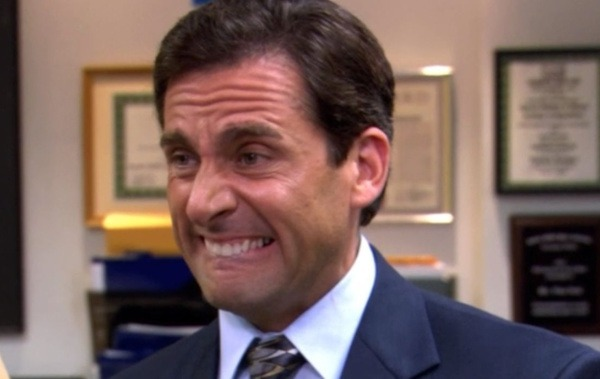

Running a broken link checker is one of my tasks for this blog. The short version is that when something breaks, I give it a few days to clear up. If it doesn't, I go back and fix the link. Usually, I remove the link if it is not needed or find a replacement link. One day, I might go into greater detail on this process. While fixing these broken links, my Grammarly plugin detects spelling and grammar errors. I'll fix them. Some errors have been on this blog for over a decade. Yikes! In addition to the writing errors, I see nutritional opinions I wrote that I no longer agree with. It's ok to be wrong, and it would be futile to go back and fix hundreds of posts because who knows what my views might be in another five or ten years. _Me reading one of my posts from 15 years ago trashing soy and carbs with the confidence of an NBA All-Star._ Worse than my "no longer current" nutritional view is the confidence that I had when I wrote those posts. I was so sure. Grammarly will often critique my current writing style as lacking a confident tone. Confident writing is considered better. But there is a reason I changed the way I write. It is because I have a history of 1,700+ posts where things I was sure about are now things I know are wrong. Today, I installed an old post plugin to notify readers that my views may have changed. I used the 7-year mark to define old.  _Here is a cringy reading list - now with a warning!_ This solves half the problem. The other half is that I no longer care to defend my current nutritional views like I did years ago when I was less wise and more certain. I stepped away from debating the bro-lifters in fitness a long time ago. For most lifters, the only teacher is injury. _Keep back squatting, bro._ As for nutrition, I can share my current diet and my results. There are many paths to good health. I found one path that is working for me. I don't want to debate protein, cholesterol, or calories. Go to an AI agent and have that debate. I do it often.

---

## Comments

### Jim
*March 15 at 2025 at 11:08 PM*

Re: Bro lifters, I remember when Art De Vany was controversial in paleo circles because he advocated using machines (at least for older lifters) and thought some Cross Fit movements were a bit too risky.  Now, on social media, popular fitness influencers all seem to be focusing on using machines.  Sam Sulek appears to use mostly machines.  I believe The Rock has been using mostly machines for years.

---

### chester
*March 16 at 2025 at 3:44 AM*

more glitter gym content.  

this is my dedication to you Mike. 

https://www.youtube.com/watch?v=z825tkkfbIo

---

### MAS
*March 16 at 2025 at 11:18 PM*

@Jim - Art mentioned he was writing a new book back in 2020. 
https://www.ihmc.us/stemtalk/episode-105/

My guess is this isn't happening.

---

### Chris
*March 17 at 2025 at 1:44 PM*

@MAS @Jim

Art totally disappeared, which is a shame as he was always good to read and original in his content. He must be in his late 80s  now?

@MAS

You show great wisdom. I find it hard to be dogmatic about anything in diet or fitness. My views change frequently and it is embarrassing to see my former confidence about so much.  The interesting element is what hasn’t changed, sifting through for the parts that have been constant.

---

### MAS
*March 17 at 2025 at 2:02 PM*

@Chris - Art is now 87 years old according to Perplexity.

---

