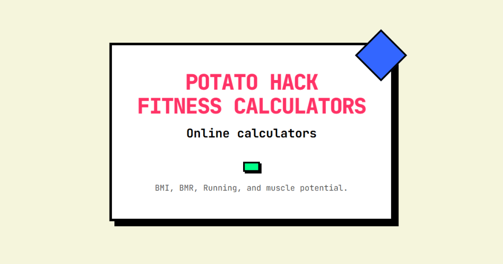

For years, I've run into the same problem: I link to an online fitness calculator, and after a few years, the link stops working. I update it, but eventually, it breaks again, and the cycle repeats.

One day, I would code my own fitness calculator site.

Not only would the links on my site not break, but I could create calculators with a better user interface that weren't dumb. By not dumb, I mean that if I enter my height on one calculator, it should also be remembered by a second calculator. If I come back months later, it should remember my height.

Another thing I dislike about most online calculators is that you need to hit submit for each numerical change. Formula-based forms should be dynamic.

Well, I finally coded my own set of fitness calculators. I haven't seen anything as good as these. It features Light/Dark mode, values persist across sessions, and calculators. You can also download the entire site as a progressive web app to your desktop.

Instead of buying another domain, I set up a subdomain on potatohack.com and named the collection "Potato Hack Fitness Calculators." Users looking to calculate their BMI or BMR may take an extra click and learn about the [Potato Hack](https://potatohack.com/).

#### [calc.potatohack.com](https://calc.potatohack.com)

_Potato Hack Fitness Calculators is hosted as a static site built with Astro and hosted for free on Netlify._

### Vibe Coding

Vibe coding is a new term that involves directing a coding AI to create what you want, rather than entering code directly yourself. I pay for GitHub Copilot, which hosts most of the major AI models. For this project, I mostly used Claude 4.0 in Agent mode. Agent mode means I hand over control to my IDE (VS Code) to the AI Agent, and it does the work with minimal input from me.

The first step was to visit Claude.ai and have it create a Project Requirement Document.

> Help me create a Project Requirement document for a web app I want to create. Interview me.

At this point, I was prompted with many questions, which I answered, and the requirements document was created. I took this document back to VS Code and fed it to GitHub CoPilot, and it started generating code.

I went back and forth with coding requests, saving my code to GitHub as new features or changes were added. I had most of the site finished in under three hours. I later had it add some more calculators.

### Feedback?

The [code is available on GitHub](https://github.com/digitalcolony/cruxcalc) for anyone to use or modify. There are no ads or pop-up windows. Post any feedback you have, including additional calculator ideas.

---

## Comments

### Peter
*June 15 at 2025 at 1:07 PM*

Thanks so much for this. I read this last night and this morning got going on something I've been wanting to do but didn't know how to get started with.

---

### MARIUS
*June 16 at 2025 at 8:23 AM*

Excellent work ! Please, can you put the kilograms on it Potato Hack Calculator ?
Thank you !

---

### exfatloss
*June 16 at 2025 at 8:42 AM*

Haha I approve the making (and maintaining!) of calculators. That said, the one I tried is the BMR one and I think all 3 formulas are very wrong. With my data, they all give me severely lower BMR than has been measured repeatedly, and (at sedentary level) even more severely under report my (also measured) TEE.

I think all these formulas are total nonsense and way under report compared to real-world data we have.

---

### MAS
*June 16 at 2025 at 1:59 PM*

@Marius - Great idea! I just updated the Potato Hack calc to have a kg/lb toggle.

@exfatloss - I confirmed the code matches the formulas. How accurate the formulas are is beyond my knowledge.

---

### Chris
*July 6 at 2025 at 4:51 PM*

Thanks for these.

---

