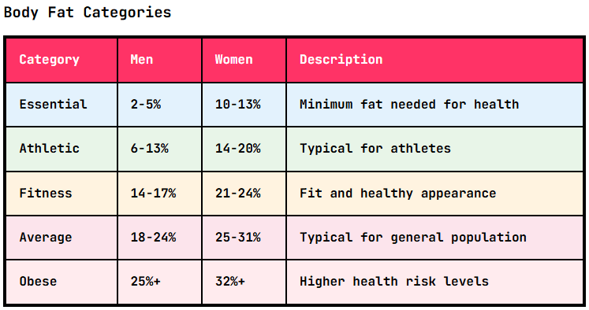

This is a follow-up to [Vibe Coding Fitness Calculators](/2025/06/vibe-coding-fitness-calculators/). I added some more calculators for Potato Hack Fitness Calculators.

1.  [Body Fat Calculator (Navy Method)](https://calc.potatohack.com/body-fat/)
2.  [Heart Rate Zones](https://calc.potatohack.com/heart-rate-zones/)
3.  [One Rep Max](https://calc.potatohack.com/one-rep-max/)

I also updated the [BMI calculator](https://calc.potatohack.com/bmi/) to include an option to use the Asian BMI scale, which is stricter than the standard BMI scale.

Claude created this nice body fat chart without me even asking.

We live in interesting times. I can now "code" faster than I blog, thanks to AI.

Any ideas for additional calculators?

---

## Comments

### Julia
*August 6 at 2025 at 6:35 PM*

Your body fat calculator (navy method) doesn't work for me!! 

It has me at "10% essential" body fat. (female).

here are my stats. 

143 pounds, 
neck 13.5 inches
waist 31 inches
Hips 39 inches. 
Height 5'7. 

See for yourself!

---

### MAS
*August 6 at 2025 at 7:04 PM*

@Julia - You are correct. Something is way off on the calculator. 

I'm in the middle of refactoring the entire site so that every slider and box looks the same. Once that is finished, I will fix this calculator and leave a comment here.

thanks for testing!

---

### MAS
*August 18 at 2025 at 8:44 PM*

@Julia - The new version of the calculators is up. I entered your numbers and got 28.8%.

---

