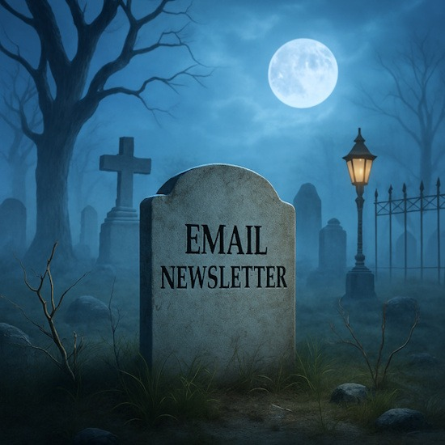

This blog no longer has an email newsletter. It seems odd to post this, since the people who signed up to receive the newsletter will not be alerted. The service that I used to send out newsletters stopped working.

I will spare you from the technical details, but trust me when I say that they screwed up, and after wasting an hour or two trying to get things working, I gave up. Instead of solving my problem, they decided I was on a "premium plan" that I was not paying for, and that would end.

Fair enough. I deleted my account.

Email newsletters have been a pain point for me for more than a decade. I spent 30 minutes researching alternatives and decided that I don't care about building my email list. I never have.

One day, I might move to SubStack, as it seems they defeated blogging in a way that Medium and others have failed to do. They do a fine job with newsletters.

In the meantime, I still have an [RSS Feed](https://criticalmas.org/subscribe/).

---

## Comments

### Chris
*August 25 at 2025 at 5:10 AM*

You mention Substack. I read quite a few authors there but I’m becoming frustrated that it is trying to turn itself into another Twitter, with a feed of short comments. 

I think your blog format remains the best.

---

