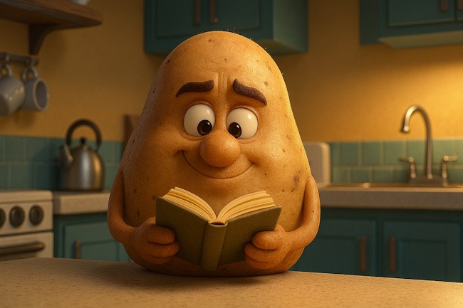

Earlier this year, I posted [Cringe](/2025/03/cringe/), describing how some older posts on this blog have outdated views on nutrition and fitness. Many of those posts covered books that I read and liked at the time, but now consider awful.

It got me thinking about how I would rank the best books today. Since books can be persuasive when we read them, I decided to limit this list to books I read at least three years ago and have successfully tested the principles.

**This list comprises books that have been beneficial to me.** Over the years, I have read many books that seemed reasonable in the short term, but as time passed, they ultimately proved to be either forgettable or inaccurate.

### #1 The Potato Hack - Weight Loss Simplified by Tim Steele

I used the Potato Hack to jumpstart a diet that led to a 40-pound weight loss, and I've maintained that weight loss for over six years now.

Other sites mention different variations of the Potato Diet, but miss the point on how a true Potato Hack works and why it leads to long-term fat loss.

I loved the book and diet so much that I took over hosting the [PotatoHack.com](https://potatohack.com/) website for the author. Recently, I began adding other coding projects to the domain, including _[Time Deck](https://time.potatohack.com/)_ and [_Fitness_](https://calc.potatohack.com/) _[Calculators.](https://calc.potatohack.com/)_

### #2 The Hungry Brain: Outsmarting the Instincts That Make Us Overeat by Stephan Guyenet

I was fortunate to have met Stephan Guyenet twice in my Paleo days here in Seattle. I followed his work and witnessed how he developed his ideas through articles and podcasts, including his insights on how the hyperpalatability of foods contributes to increased appetite and obesity.

By the time I read The Hungry Brain, I had been thinking about and practicing the concepts for a few years. Reading his ideas and dismissing them is easy, but actually applying the concept of deliberately reducing flavor to retrain the brain’s perception of hunger became the foundation of my [Modern Peasant Diet](/2016/11/designing-modern-peasant-diet/). I practiced this daily throughout my diet phase, and it has since become a lasting habit.

The Potato Diet gets a positive mention in the book.

### #3 Forever Fat Loss - Ari Whitten

The three big ideas I recall from Forever Fat Loss were to use higher volume, higher protein, and lower flavor to trigger "forever" fat loss. It was this book primarily that led me to create the Potatoes & Protein Diet. As I was getting leaner on potatoes, I wanted to counteract the loss of muscle, so I started adding protein-rich foods on top of my potatoes.

[Potatoes and Protein – A No Hunger Template For Fat Loss](/2018/12/potatoes-and-protein-a-no-hunger-template-for-fat-loss/)

### #4 12 Paleo Myths: Eat Better Than A Caveman - Matt Stone

When I read this book in 2014, I still believed that the Paleo diet was generally beneficial, although I felt that low-carb interpretations had unfortunately overshadowed it.

I hadn’t explored other criticisms at the time. _12 Paleo Myths_ challenged many of Paleo’s key claims, and I found its arguments quite convincing. While I don’t agree with many of Stone’s views, I believe that without _12 Paleo Myths_, I might have delayed progressing on my current path by several years.

### #5 SuperFoods Rx: Fourteen Foods That Will Change Your Life by Steven G. Pratt

In 2007, I rekindled my interest in nutrition. It was a topic I hadn't given much thought to since college. My idea was to use nutrient-dense foods to prevent illness. If you dive into the archives, you will see several posts regarding that quest.

[SuperFoods Rx](/2007/10/are-these-the-14-superfoods/) was the first book on that topic. I later read more. This is probably not even the best SuperFoods book. Maybe [Bowden's is better](/2008/03/150-superfoods-because-14-just-wasnt-enough/). However, it was at this point that my interest was sparked, leading me to learn more about food and cooking.

Favoring nutrient-dense foods is now a habit.

### Honorable Mentions

I want to mention two books that I read more recently that made an impact on me, but it is too soon to tell if either will stand the test of time like the books I listed above: [The End of Craving](/2024/10/the-end-of-craving/) and Proteinaholic.

I never posted on Proteinaholic, but the short version is that the author advocates for a whole-food, plant-based diet. He argues that excessive animal protein may be more detrimental than animal fat. I acknowledge that I might be biased in believing this message, because [my current diet](/2025/07/what-i-eat-and-what-i-dont-eat-2025-edition/) already follows his advice. I also find this current obsession with MOAR PROTEIN to be increasingly ridiculous.

What nutritional books have stood the test of time with you?

---

## Comments

### exfatloss
*October 5 at 2025 at 2:21 AM*

Haha, I misread your 3 years rule at first. What's more likely to be true, something read more recently (less time to change your mind) or something read a long time ago (more lindy?)

I really, strongly disliked both Potato Hack and Hungry Brain heh.

Funny, I'm nearly 100% anti-vegan, but I do agree with (many of) them on the ridiculous protein talk. We have tested how much protein people need, and it's not very much. Nobody in America is undereating protein except maybe some seniors.

I'd put Nature Wants us to be Fat up there. The author is a low-carb guy who hasn't heard that everybody moved on; but the polyol pathway he describes is still interesting - it could explain how salt and glutamate (umami flavor) can cause the body to turn glucose into fructose, with all that entails.

Pretty interesting! Check it out.

I did like End of Cravings, although 1. I'm not convinced any of that stuff is very causal 2. it's not at all actionable for obesity IMO. But I've always been skeptical of dumping random vitamins into base foods..

---

### Geoff
*October 5 at 2025 at 11:31 AM*

He wrote a book on the topic, but the advice that really stands the test of time for me is Michael Pollan’s simple admonition: “Eat food. Not too much. Mostly plants.” Sometimes less really is more.

Books come and go. Nutrition dogma runs in cycles, driven at least as much by sales potential as the actual research. I can’t escape the conclusion that this is because there’s simply more money to be made in keeping people fat, sick, and confused than there is in helping them get healthy.

Pollan’s advice cuts through all the crap and gets to the heart of things. You can’t build a nutritional empire with just 7 words, but you can drive change. Keep it simple.

---

### exfatloss
*October 5 at 2025 at 5:58 PM*

@geoff

Not to sound too combative, but I couldn't disagree more :) I think Pollan is one of those guys who think they sound clever if they say nonsensical trivialities. Pollan's "advice" is more of the same BS that's failed us and keeps pushing us towards more obesity.

1. Define food, lol. That's avoiding the whole debate of what is "food that we should be eating."

2. Not too much is wrong IMO (you are eating too much because your metabolism is broken because you ate the wrong "food" see #1)

3. Mostly plants is wrong IMO (completely orthogonal to the mechanics of obesity)

Nonsense like Pollan's advice is what keeps us fat and sick.

---

### Victoria
*October 5 at 2025 at 7:02 PM*

“ Not to sound too combative”

LOL

You think people are following Pollens advice and it’s making them obese? That might be the most idiotic thing I’ve read this month.

Hope that didn’t sound too combative. :)

---

### MAS
*October 5 at 2025 at 9:22 PM*

@exfatloss - End of Cravings is a theory worth testing. He could be wrong or partially right. I hope someone tests those ideas. But the fact that other than my review and yours, I haven't seen any discussion of his ideas. 

Perhaps one day I'll write a full post in defense of the Hungry Brain. I really don't feel much like blogging these days. Vibe coding is much more fun. :) 

@all - Michael Pollan is a good writer, but other than that one quote, which I didn't find interesting or persuasive at the time, I can't recall anything he said that made an impact on me. My guess is that 90% of the people who read his books aren't struggling with obesity.

---

### exfatloss
*October 5 at 2025 at 10:40 PM*

@Victoria

Yes, because Pollan's advice is idiotic :) But it makes sense, he's always been an idiot.

@MAS

Agreed, the quote is a feel-good thing for people who never struggled with obesity. Basically just signaling how virtuous he is lol for having restraint and not eating meat lol.

---

### Aaron
*October 7 at 2025 at 5:32 AM*

Honestly, more and more I'm eating beans. Maybe it is the magnesium or fiber. Maybe it is the potassium or folate. Maybe it is all the micronutrients. It's hard to go when when almost every population study on earth points to those that eat the most beans seem to live the longest. There might just be something there. And cooking beans (or bean pastas), seems to do exactly what it needs to do for us to get all the nutrition with minimal damage to our system. Did I mention it is cheap cheap cheap? I round it out with heated and cooled rice. Also, veggies and fruits are major staples. EVOO for taste and pumpkin seeds at times. Fish/chicken and natto for other types of protein(red meat only once in a while). BOOM, nutrition solved.

---

### MAS
*October 7 at 2025 at 1:55 PM*

@Arron - Agreed on fiber. I haven't thought about magnesium, potassium, and folate. 

My Norwegian neighborhood just got an Asian grocery store, so my natto intake has gone from once a month to 2-3 times a week. 

According to Perplexity, 95% of Americans are fiber-deficient, and almost no one is protein-deficient. We don't need MOAR PROTEIN.

---

### exfatloss
*October 7 at 2025 at 4:19 PM*

I tried Natto for the first time when I visited Japan recently, and I found it way less "disgusting" than people claim. It wasn't bad at all. Certainly a strange taste, but it's not even as strong as a decent blue cheese or anything, just slightly unfamiliar.

Agreed that rice &amp; beans is a great combo. That's actually what I craved and had for my last refeed, lol. Made a giant stew!

I do think that humans in general adapted, over time, to various dietary niches that we all do relatively well in. And then there's been a little bit of specialization in the last 5-10k years (even better starch adaptation, dairy adaptation, ..).

But basically we probably all do relatively well on "paleo mammoth hunter gatherer carnivore" type diets, and also on starch-based "peasant diets" as you call it.

I wish people would stop arguing which of these is more "natural" or "ancestral" or healthy and just get over the fact that neither of these seem to produce any diseases of civilization in ancestral peoples.

---

### Brian
*November 6 at 2025 at 8:21 PM*

I like this list. For some reason I will start potato hacking, then drift away, but always seem to come back to it. Cheap, easy, fulfills most needs. I don't know why I drift. Human nature I guess. But its solid advice. Its tough to overeat on potatoes (at least plain potatoes or with minimal sauces, deep fried is more like eating oil with a potato vessel).

---

